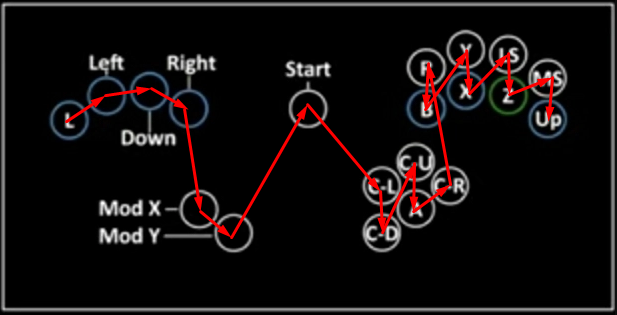

# Button Mapping

This document describes the runtime remapping feature. If you're looking for default button mapping, check the [MODES Readme](MODES.md).

### Runtime remapping information

This project allows you to modify the default pin -> button mappings (i.e that of GpioToButtonSets::F1) in a persistent manner at runtime, i.e you don't need to download any development tools, modify the code and reprogram the board, follow these instructions once and your mappings will be changed forever and will persist even when you update the firmware.

When plugging the board, press whichever button is mapped to GP17 (in the default pinout, it's Up). 3 seconds later, you'll enter remapping mode. Press the buttons in the following order: L Left Down Right MX MY Start CLeft CDown CUp A CRight R B Y X LS Z MS Up.

Note that you must release GP17 before the 3 seconds expire, or it will be considered as the first button press (L).

So, if for example you haven't followed the default pinout when soldering and would like to go back to the default B0XX/F1, you'll press the buttons in this order:

Say you'd like to swap L/MX, and R/Z, you'd press the buttons in this order:

**Not Pictured: up2 (left hand up):** up2 should be the 21st button you press, after up (bottom right pinky).

When plugging the board in, wait for 3+ seconds before starting to press any buttons.

The remapping will be committed when you've pressed 21 different buttons. You must restart (i.e unplug/replug) to enter another mode. The pins you can map something to are GP 0-22 and GP 26-27, i.e all accessible pins EXCEPT GP28, that is dedicated to the GC Data pin.

If it doesn't appear to work, double check all 21 of your buttons work. Note that runtime remapping doesn't change what buttons you need to press to enter a given mode, as it is the pin number that matters.