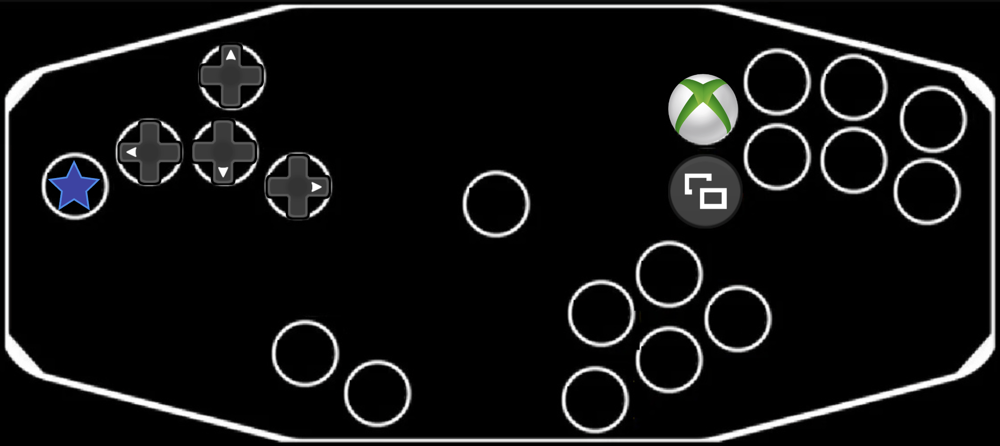
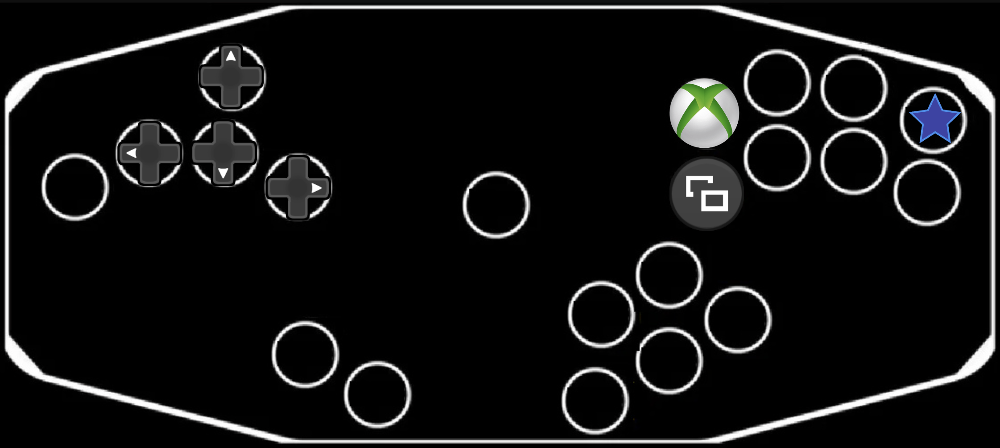
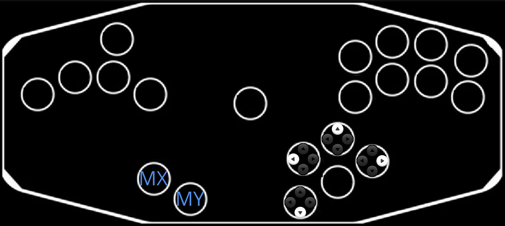

# Modes

As of this release, 12 modes are built-in. There are two additional specialized programming modes.

## TOC

0. [BOOTSEL](#bootsel)
0. [REMAP](#run-time-remapping)
2. [GCN (Ultimate)](#ultimate)
3. [GCN (Melee)](#melee)
4. [GCN (P+)](#p)
5. [Xbox360 (Leverless)](#xinput-leverless-fightstick)
6. [Xbox360 (Dedicated)](#xinput-xbox360-controller)
7. [Xbox360 (Melee)](#xinput-xbox360-controller-melee)
7. [WFPP (Dedicated)](#wired-fight-pad-pro-nintendo-switch-controller)
7. [WFPP (Melee)](#wired-fight-pad-pro-melee)
7. [WFPP (P+)](#wired-fight-pad-pro-p)
8. [8KRO Keyboard](#8kro-keyboard)
9. [HID (Ultimate)](#hid-controllers)
10. [HID (Melee)](#hid-controllers)
11. [HID (P+)](#hid-controllers)

## Programming Modes

There are two specialized modes for programming the firmware.

### BOOTSEL 

- `GP16` (by default, `CRight`) => `BOOTSEL` mode. This allows for updating the firmware without taking apart the controller to access the Pico.

See dedicated [README](PROGRAMMING.md#updating-the-firmware).

### Run-time Remapping

- `GP17` (by default, `Up`) => Runtime remapping. 
  
See dedicated [README](PROGRAMMING.md#runtime-button-remapping).

## GameCube Controller Modes

There are several modes that can be used either in USB modes (pretending to be a GameCube controller plugged int a USB Adapter), and Joybus mode (plugged in drectly with a GameCube compatible cable to a compatible console or physical USB Adapter).

### Ultimate 

- `GP6` (by default, `MX`) => GCN (Ultimate) Joybus mode.
- `GP6` (by default, `MX`) => GCN (Ultimate) USB adapter mode.

### Melee
- `No button` => GCN (Melee) Joybus mode.
- `GP12` (by default, `CUp`) => GCN (Melee) USB adapter mode.
  

### P+
- `GP2` / `GP7` (by default, `Right` / `MY`) => GCN (P+) Joybus mode.
- `GP7` (by default, `MY`) => GCN (P+) USB adapter mode.

## USB only Modes

### Xbox 360 Controllers

XInput mode is meant to provide extra compatibility options for PC and the Xbox family of consoles (Brooks Wingman XB required) by identifying as an Xbox 360 Controller. Movement controls map to the left stick, and the C buttons map to the right stick.

#### XInput (Leverless Fightstick)

- `No Button` => XInput (Xbox360 DAC algorithm + Xbox360 Leverless USB configuration).

XInput can function as a leverless fightstick, offering a different default button mapping. It still is technically an Xbox controller, so you have two analog sticks and a d-pad for movement options, and movement is set to the left stick. It doesn't use the "melee-style" layout and is a little easier to remap and play other genres in.

The face buttons are mapped directly to the first four buttons on the right hand, with the L/R triggers on the top two right most buttons, and L/R bumpers immediately underneath them.

In this scheme you can only access cardinals and diagonals on the control sticks. `Start`, `MX` and the `Left Stick` have additional buttons mapped when combined with `L`.

#### XInput (Xbox360 Controller)

- `GP14` (by default, `A`) => XInput (Xbox360 DAC algorithm + Xbox360 USB configuration).

In Xbox360 mode, `MX`/`MY` and `LS`/`MS` are repurposed. This means you can only access cardinals and diagonals on the control stick. `Start`, `B` and the `Left Stick` have additional buttons mapped when combined with `MS`.

#### XInput (Xbox360 Controller Melee)

- `GP13` (by default, `CLeft`) => XInput (Melee DAC algorithm + Xbox360 USB configuration).

With the Melee F1 DAC algorithm, `Start` is mapped to Start (aka Menu). `L`, `R` and `Z` are respectively mapped to LT, RT and ZR (aka RB). ZR (aka LB), Back (aka View), Home, LS Press, and RS Press are inaccessible.

### Nintendo Switch Controllers

This is a "Wired Fight Pad Pro":

#### Wired Fight Pad Pro (Nintendo Switch Controller)

- `GP4` (by default, `Left`) => Wired Fight Pad Pro with dedicated logic (Wired Fight Pad Pro DAC algorithm + Wired Fight Pad Pro USB configuration).

In dedicated mode, `MX`/`MY` and `LS`/`MS` are repurposed. This means you can only access cardinals and diagonals on the control stick.

#### Wired Fight Pad Pro (Melee)

- `GP5` (by default, `L`) => Wired Fight Pad Pro with Melee logic (Melee DAC algorithm + Wired Fight Pad Pro USB configuration).

With the Melee F1 DAC algorithm, `Start` is mapped to +. `L`, `R` and `Z` are respectively mapped to ZL, ZR and R. That means -, Home, L and Photo are inaccessible. The purpose of this mode is to allow playing on a PC setup with other people that are using vanilla Gamecube controllers through an adapter, as Slippi can't handle multiple adapters at once. There may be slight analog discrepancies occuring as a result of using the Standard Controller mode (max 1 tick).

#### Wired Fight Pad Pro (P+)

- `GP2` (by default, `Right`) => Wired Fight Pad Pro with P+ logic (P+ DAC algorithm + Wired Fight Pad Pro USB configuration).

### PC Controllers

#### 8KRO Keyboard

- `GP0` (by default, `Start`) => 8KRO Keyboard (8 Keys set DAC algorithm + 8KRO Keyboard USB configuration).

#### HID Controllers

- `GP22` (by default, `Y`) resp. => HID controller with Ult logic.

- `GP21` (by default, `X`) resp. => HID controller with Melee logic.

- `GP10` (by default, `LS`) resp. => HID controller with P+ logic.
