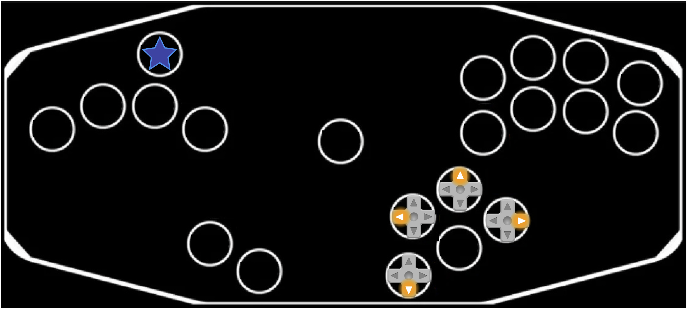

# Modes

As of this release, 13 modes are built-in. There are two additional specialized programming modes.

## TOC

0a. [BOOTSEL](#bootsel)
0b. [REMAP](#remapping)
1. [GCN (Ultimate)](#gcn-ultimate)
2. [GCN (Melee)](#gcn-melee)
3. [GCN (P+)](#gcn-plus)
4. [Xbox360 (Leverless)](#xbox360-leverless)
5. [Xbox360 (Dedicated)](#xbox360-dedicated)
6. [WFPP (Dedicated)](#wfpp-dedicated)
7. [8KRO Keyboard](#keyboard)
8. [HID (Ultimate)](#hid-ultimate)
9. [HID (Melee)](#hid-melee)
10. [HID (P+)](#hid-plus)
11. [WFPP (Melee)](#wfpp-melee)
12. [WFPP (P+)](#wfpp-plus)
13. [Xbox360 (Melee)](#xbox360-melee)

## Programming Modes

There are two specialized modes for programming the firmware.

<a name="bootsel"/>
- GP16 (by default, CRight) => BOOTSEL mode. This allows for updating the firmware without taking apart the controller to access the Pico.

### How to program your board:

- Download the latest release (on the right of the Github page)

- Plug in your Raspberry Pico to your computer by holding pin GP16 (the CRight button in the advised pinout) via USB (i.e BOOTSEL mode), or while holding the "BOOTSEL" white button on the board.

- The board should appear as an external drive. Put the .uf2 in there. The board should disconnect and be ready for use.

If you reconnect the board in BOOTSEL mode, you won't see the .uf2 file anymore. This is normal, expected behavior.

<a name="remapping"/>
- GP17 (by default, Up) => Runtime remapping. See dedicated [README](MAPPING.md).

## GameCube Controller Modes

There are several modes that can be used either in USB modes (pretending to be a GameCube controller plugged int a USB Adapter), and JoyBus mode (plugged in drectly with a GameCube compatible cable to a compatible console or physical USB Adapter).

<a name="gcn-ultimate"/>
* GP6 (by default, MX) => GCN (Ultimate) JoyBus mode.
* GP6 (by default, MX) => GCN (Ultimate) USB adapter mode.

<a name="gcn-melee"/>
* No button => GCN (Melee) JoyBus mode.
* GP12 (by default, CUp) => GCN (Melee) USB adapter mode.

<a name="gcn-plus"/>
* GP2 / GP7 (by default, Right / MY) => GCN (P+) JoyBus mode.
- GP7 (by default, MY) => GCN (P+) USB adapter mode.

## USB only Modes

### Xbox 360 Controllers

<a name="xbox360-leverless"/>
- No Button => XInput (Xbox360 DAC algorithm + Xbox360 Leverless configuration).

<a name="xbox360-dedicated"/>
- GP14 (by default, A) => XInput (Xbox360 DAC algorithm + Xbox360 USB configuration).

<a name="xbox360-melee"/>
- GP13 (by default, CLeft) => XInput (Melee DAC algorithm + Xbox360 USB configuration).

### Nintendo Switch Controllers

<a name="wfpp-dedicated"/>
- GP4 (by default, Left) => Wired Fight Pad Pro with dedicated logic (Wired Fight Pad Pro DAC algorithm + Wired Fight Pad Pro USB configuration).

<a name="wfpp-melee"/>
- GP5 (by default, L) => Wired Fight Pad Pro with Melee logic (Melee DAC algorithm + Wired Fight Pad Pro USB configuration).

<a name="wfpp-plus"/>
- GP2 (by default, Right) => Wired Fight Pad Pro with P+ logic (P+ DAC algorithm + Wired Fight Pad Pro USB configuration).

### PC Controllers

<a name="keyboard"/>
- GP0 (by default, Start) => 8KRO Keyboard (8 Keys set DAC algorithm + 8KRO Keyboard USB configuration).

<a name="hid-ultimate"/>
- GP22 (by default, Y) resp. => HID controller with Ult logic.

<a name="hid-melee"/>
- GP21 (by default, X) resp. => HID controller with Melee logic.

<a name="hid-plus"/>
- GP10 (by default, LS) resp. => HID controller with P+ logic.