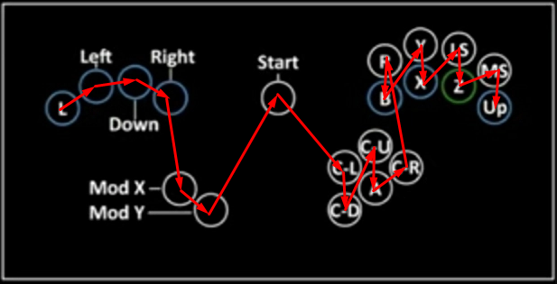
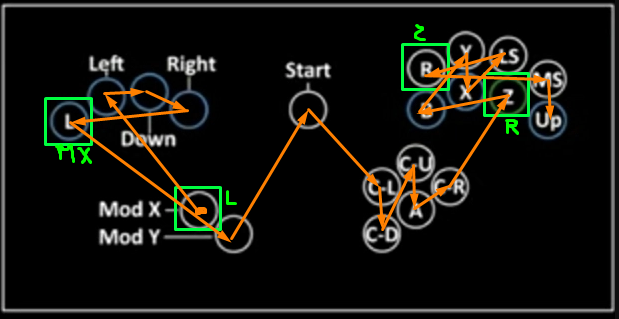

# Programming Your Controller

## TOC

1. [Updating the Firmware](#updating-the-firmware)
2. [Runtime Button Remapping](#runtime-button-remapping)
3. [Changing the Source Code](#making-changes-to-the-source-code)

## Updating the Firmware

This describes the `BOOTSEL` fimrware update feature.

### Updating the Firmware via Computer

1. Obtain the appropriate pre-compiled binary (`.uf2` file) for your desired feature set.
2. Plug your controller into your computer via USB while holding pin `GP16` (`CRight`) to enter `BOOTSEL` mode.
   1. **OR** Plug your Raspberry Pico into your computer via USB while holding the `BOOTSEL` white button on the board to enter `BOOTSEL` mode.
3. The board should appear as an external drive. Put the compiled binary you want (`.uf2` file) in that directory.
4. The device should disconnect, reboot and be ready for use in its default `no button` state.
5. If you reconnect the board in `BOOTSEL` mode, you won't see the `.uf2` file in the external drive. This is normal, expected behavior.

### Downloading Pre-Compiled Binaries

1. Download the appropriate release on the GitHub [Releases page](https://github.com/doyouknowbobby/doyouknowb0xxy/releases) for your desired feature set. The most recent version will be first, but older versions will also work, though they may be missing certain features, modes, fixes, etc.

This project obeys semantic versioning, so 
* nothing should ever be **taken away** or **changed** without the version number increasing by 1 in a major release (like from `1.3` to `2.0`). You should update if the new features or modes or changes to existing features sound interesting, but it may change the way you've previously used the controller.
    * Upstream changes from parent forks that change the way USB Communications work. 
    * Changing the button to select an existing mode or changing the default mode with no button pressed.
    * Updating a button inside of a DAC Algorithm to do something different.
* new features that don't change existing ones will increase the version number by 0.1 in a minor release (like from `1.3` to `1.4`). You should update if the new features or modes sound interesting, but it shouldn't change anything about existing behavior unless it was not working correctly.
    * Adding a new mode and choosing an unused button to select it.
    * Updating a button inside of a DAC Algorithm to add a different function when a modifier button is held at the same time.
* bugfixes and documentation changes will increase the version number by 0.0.1 in a patch release (like from `1.3` to `1.3.1`). You should update when these come out for a controller that works exactly the same, but better.
    * Updating documentation (README, Images, etc) or adding tests without touching actual code.
    * Changing the button to select an existing mode or changing the default mode with no button pressed in order to fix a bug and make it perform as advertised.
    * Updating a button inside of a DAC Algorithm in order to fix a bug and make it perform as advertised.

### Compiling Binaries From Source Code

Instructions vary by IDE. Instructions and screenshots *will be* provided for Visual Studio Code but I don't provide support for this feature beyond this document.

## Runtime Button Remapping

This describes the runtime remapping feature. 

If you're looking for default button mapping, check the [MODES Readme](MODES.md).

### Remapping Instructions

This project allows you to modify the default pin -> button mappings (i.e that of `GpioToButtonSets::F1`) in a persistent manner at runtime, i.e you don't need to download any development tools, modify the code and reprogram the board, follow these instructions once and your mappings will be changed **forever** and will persist **even when you update the firmware**.

When plugging the board, press `GP17` (`Up`). 3 seconds later, you'll enter remapping mode. Press the buttons in the following order:

1. `L`
2. `Left`
3. `Down`
4. `Right`
5. `MX`
6. `MY`
7. `Start`
8. `CLeft`
9. `CDown`
10. `CUp`
11. `A`
12. `CRight`
13. `R`
14. `B`
15. `Y`
16. `X`
17. `LS`
18. `Z`
19. `MS`
20. `Up`
21. `Up2`

Note that you must release `GP17` before the 3 seconds expire, or it will be considered as the first button press (`L`).

So, if for example you haven't followed the default pinout when soldering and would like to go back to the default B0XX/F1, you'll press the buttons in this order:

Say you'd like to swap `L`/`MX`, and `R`/`Z`, you'd press the buttons in this order:

**Not Pictured: `Up2` (left hand up):** `Up2` should be the 21st button you press, after `Up` (bottom right pinky).

When plugging the board in, wait for 3+ seconds before starting to press any buttons.

The remapping will be committed when you've pressed **21** different buttons. You must restart (i.e unplug/replug) to enter another mode. The pins you can map something to are GP 0-22 and GP 26-27, i.e all accessible pins EXCEPT `GP28`, that is dedicated to the GC Data pin.

If it doesn't appear to work, double check all 21 of your buttons work. Note that runtime remapping doesn't change what buttons you need to press to enter a given mode, as it is the pin number that matters.

## Making Changes to the Source Code

You should do that. I did [that](https://github.com/doyouknowbobby/doyouknowb0xxy/). As did [the person before me](https://github.com/rana-sylvatica/pico-rectangle-rana-digital).

### Firmware explanation

The job of a digital controller firmware can be split in three questions:
- Convert electrical inputs into knowing which buttons on the digital controller is pressed. Example: "pin 20 is low" => "X is pressed".
- Convert (which buttons of the digital controller are pressed) to an emulated controller state. For exemple, when emulating a Gamecube controller and using the Melee Frame1 logic, you would press `MX`+`Down`+`Right` and expect the controller to send an angle suitable for long wavedashes to the right.
- Communicate over a given protocol with the PC or console your controller is plugged to. This implies asking the question of "what controller are you pretending to be?".

The modes of the firmware are modular based on this separation. A mode is the combination of 3 choices:
- The "GPIO to button set" i.e how you name your pins. There's only one choice by default. It can be remapped at runtime in a way that will persist when shut down.
- The "DAC conversion algorithm" or put shortly, "logic". There are Melee F1, P+ and Ultimate logics that work in USB or Joybus communication protocols, plus specific ones for specific USB configurations.
- The "communication protocol (+ usb configuration)". The controller can become a Gamecube controller, or it can become a USB device, in which case you have the choice between a Gamecube controller to USB adapter that has a Gamecube controller (your controller) plugged in P1 (the default), a generic HID controller, a keyboard, or a Switch-compatible controller (aka WFPP).

You will access a given mode by holding a given button down while you plug-in the controller.

A + B will refer from now on as a combination of a DAC conversion algorithm and a communication protocol(+usb config is protocol is USB).

The code architecture follows the outline previously explained. The code is separated in `gpio_to_button_sets`, `dac_algorithms`, `usb_configurations`, `communication_protocols`.

If you want to modify or extend the firmware, you shouldn't need to modify `usb_configurations` unless you want to, say, add a button to the HID controller you're emulating. And you shouldn't ever need to modify `communication_protocols`. Modify `dac_algorithms` to change things such as coordinates, modify `gpio_to_button_sets` only if your firmware is so unlike the Frame1 default that your buttons have different names. (Ex more than 2 modifiers...)

This project doesn't utilize TinyUSB, but instead implements the USB protocol itself to manage runtime-dependant descriptors. This is largely based on the dev_lowlevel pico-example project, although fully migrated to C++, with some extensions such as WCID compatibility and multi-packet control transfers.

